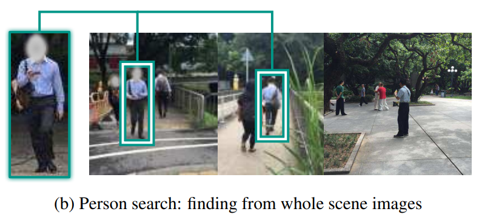

# Awesome-Person-Search
> Person search here means a joint detection and re-id on natural images. We also provide researches on character search here, which is close to person search.

### Contents

+ **Datasets**

    |  Datasets   | #Images | #Boxes  |    Gallery    |  #ID  | #Avg Instance per ID |    #Views     |          Scene          | Box per Background |                            Links                             |
    | :---------: | :-----: | :-----: | :-----------: | :---: | :------------------: | :-----------: | :---------------------: | :----------------: | :----------------------------------------------------------: |
    |  CUHK-SYSU  | 18,184  | 23,430  |     50~4K     | 8,432 |          3           |       -       | surveillance, movies/TV |         -          | [homepage](https://github.com/ShuangLI59/person_search), [google-drive](https://drive.google.com/file/d/1z3LsFrJTUeEX3-XjSEJMOBrslxD2T5af/view) |
    |     PRW     | 11,816  | 34,304  |     6,112     |  932  |          36          |    6 cams     |      surveillance       |       5,717        |   [homepage](https://github.com/liangzheng06/PRW-baseline)   |
    |    LSPS     | 51,836  | 60,433  |    33,673     | 4,067 |          15          |    17 cams    |      surveillance       |       3,555        |                              -                               |
    | MovieNet-CS | 160,816 | 274,274 | 2K / 4K / 10K | 3,087 |        10~50         | 132,115 shots |         movies          |        2.1         | [google-drive_dir](https://drive.google.com/drive/folders/1wbq5jptOGxXDE0ze1tAMdcvXEaE1Wybt) |

+ **Papers & Codes**

### Papers

Papers in each years are listed as conference first, journal last. Currently, only papers in top conferences and top journals are included. We recommend you download papers with links below, but you can also find them on [google-drive](https://drive.google.com/drive/u/0/folders/18uP-XXrdCXEEVMG1DHPJllBH1XeOxFPW). Considering the increasing number of papers in this field, we roughly summarize some articles and put them into the following categories:

|                   [Survey](src/Survey.md)                    | [Un-/Self-/Weaky-/Semi- Supervised Learning](src/XSupervised_Learning.md) |
| :----------------------------------------------------------: | :----------------------------------------------------------: |
| [**Transfer Learning and Domain Adaptation**](src/Transfer_Learning_and_Domain_Adaptation.md) |       [**Character Search**](src/Character_Search.md)        |
|       [**Two-step Methods**](src/Two-step_Methods.md)        |                                                              |

#### arXiv papers

+ [GLCNet+MovieNet-CS] Global-Local Context Network for Person Search [[arXiv](https://arxiv.org/pdf/2112.02500.pdf)] [[code](https://github.com/ZhengPeng7/GLCNet)]

+ [STL] Subtask-dominated Transfer Learning for Long-tail Person Search [[arXiv](https://arxiv.org/pdf/2112.00527.pdf)]

+ [ACAE] Learning Context-Aware Embedding for Person Search [[arXiv](https://arxiv.org/pdf/2111.14316.pdf)]

+ [UDGNet+PSM] Head and Body: Unified Detector and Graph Network for Person Search in Media [[arXiv](https://arxiv.org/pdf/2111.13888.pdf)]

#### 2022

+ [PSTR] PSTR: End-to-End One-Step Person Search With Transformers (CVPR) [[paper](https://arxiv.org/pdf/2204.03340.pdf)] [[code](https://github.com/JialeCao001/PSTR)]
+ [COAT] Cascade Transformers for End-to-End Person Search (CVPR) [[paper](https://arxiv.org/pdf/2203.09642.pdf)] [[code](https://github.com/Kitware/COAT)]
+ [CGPS] Exploring Visual Context for Weakly Supervised Person Search (AAAI) [[paper](https://arxiv.org/pdf/2106.10506.pdf)] [[code](https://github.com/ljpadam/CGPS)]

#### 2021

+ [AGWF] End-to-End Trainable Trident Person Search Network Using Adaptive Gradient Propagation (ICCV) [[paper](https://openaccess.thecvf.com/content/ICCV2021/papers/Han_End-to-End_Trainable_Trident_Person_Search_Network_Using_Adaptive_Gradient_Propagation_ICCV_2021_paper.pdf)]
+ [R-SiamNets] Weakly Supervised Person Search With Region Siamese Networks (ICCV) [[paper](https://arxiv.org/pdf/2109.06109.pdf)]
+ [PGA] Prototype-Guided Saliency Feature Learning for Person Search (CVPR) [[paper](https://openaccess.thecvf.com/content/CVPR2021/papers/Kim_Prototype-Guided_Saliency_Feature_Learning_for_Person_Search_CVPR_2021_paper.pdf)]
+ [AlignPS] Anchor-Free Person Search (CVPR) [[paper](https://arxiv.org/abs/2103.11617)] [[code](https://github.com/daodaofr/AlignPS)]
+ [SeqNet] Sequential End-to-end Network for Efficient Person Search (AAAI) [[paper](https://arxiv.org/pdf/2103.10148.pdf)] [[code](https://github.com/serend1p1ty/SeqNet)]
+ [DKD] Diverse Knowledge Distillation for End-to-End Person Search (AAAI) [[paper](https://arxiv.org/pdf/2012.11187)]
+ [Survey2021] Person Search Challenges and Solutions: A Survey (IJCAI) [[paper](https://arxiv.org/pdf/2105.01605)]

#### 2020

+ [TCTS] TCTS: A Task-Consistent Two-Stage Framework for Person Search (CVPR) [[paper](https://openaccess.thecvf.com/content_CVPR_2020/papers/Wang_TCTS_A_Task-Consistent_Two-Stage_Framework_for_Person_Search_CVPR_2020_paper.pdf)]
+ [NAE] Norm-Aware Embedding for Efficient Person Search (CVPR) [[paper](https://openaccess.thecvf.com/content_CVPR_2020/papers/Chen_Norm-Aware_Embedding_for_Efficient_Person_Search_CVPR_2020_paper.pdf)] [[code](https://github.com/dichen-cd/NAE4PS)]
+ [IGPN] Instance Guided Proposal Network for Person Search (CVPR) [[paper](https://openaccess.thecvf.com/content_CVPR_2020/papers/Dong_Instance_Guided_Proposal_Network_for_Person_Search_CVPR_2020_paper.pdf)]
+ [BINet] Bi-Directional Interaction Network for Person Search (CVPR) [[paper](https://openaccess.thecvf.com/content_CVPR_2020/papers/Dong_Bi-Directional_Interaction_Network_for_Person_Search_CVPR_2020_paper.pdf)]
+ [APNet+LSPS] Robust Partial Matching for Person Search in the Wild (CVPR) [[paper](https://arxiv.org/pdf/2004.09329.pdf)] [[code](https://github.com/zhongyingji/APNet)]
+ [OMS] Online Multi-modal Person Search in Videos (ECCV) [[paper](https://arxiv.org/pdf/2008.03546.pdf)]
+ [PPCC+CSM] Person Search in Videos with One Portrait Through Visual and Temporal Links (ECCV) [[paper](https://arxiv.org/pdf/1807.10510)] [[code](https://github.com/hqqasw/person-search-PPCC)]
+ [HOIM] Hierarchical Online Instance Matching for Person Search (AAAI) [[paper](https://ojs.aaai.org/index.php/AAAI/article/view/6623/6477)] [[code](https://github.com/dichen-cd/HOIM-PyTorch)]
+ [DMRNet] Decoupled and Memory-Reinforced Networks - Towards Effective Feature Learning for One-Step Person Search (AAAI) [[paper](https://arxiv.org/pdf/2102.10795)]
+ [BPNet] End-to-End Thorough Body Perception for Person Search (AAAI) [[paper](https://ojs.aaai.org/index.php/AAAI/article/view/6886/6740)]
+ [Survey2020] Person search: New paradigm of person re-identification A survey and outlook of recent works (ImageVisComput) [[paper](https://www.researchgate.net/publication/342599179_Person_search_New_paradigm_of_person_re-identification_A_survey_and_outlook_of_recent_works/fulltext/5efc8586299bf18816f6243a/Person-search-New-paradigm-of-person-re-identification-A-survey-and-outlook-of-recent-works.pdf)]

#### 2019

+ [RDLR] Re-ID Driven Localization Refinement for Person Search (ICCV) [[paper](https://arxiv.org/pdf/1909.08580)]
+ [QEEPS] Query-Guided End-To-End Person Search (CVPR) [[paper](https://arxiv.org/pdf/1905.01203)] [[code](https://github.com/munjalbharti/Query-guided-End-to-End-Person-Search)]
+ [CTXG] Learning Context Graph for Person Search (CVPR) [[paper](https://arxiv.org/pdf/1905.01203.pdf)] [[code](https://github.com/sjtuzq/person_search_gcn)]

#### 2018

+ [RCAA] RCAA: Relational Context-Aware Agents for Person Search (CVPR) [[paper](https://www.ecva.net/papers/eccv_2018/papers_ECCV/papers/Xiaojun_Chang_RCAA_Relational_Context-Aware_ECCV_2018_paper.pdf)]
+ [CLSA] Person Search by Multi-Scale Matching (ECCV) [[paper](https://arxiv.org/pdf/1807.08582)]
+ [MGTS] Person Search via A Mask-guided Two-stream CNN Model (ECCV) [[paper](https://arxiv.org/pdf/1807.08107)]

#### 2017

+ [NPSM] Neural Person Search Machines (ICCV) [[paper](https://arxiv.org/pdf/1707.06777)]
+ [OIM+CUHk-SYSU] Joint Detection and Identification Feature Learning for Person Search (CVPR) [[paper](https://arxiv.org/pdf/1604.01850)] [[code](https://github.com/ShuangLI59/person_search), [unofficial_code](https://github.com/serend1p1ty/person_search), [dataset](https://drive.google.com/file/d/1z3LsFrJTUeEX3-XjSEJMOBrslxD2T5af/view)]
+ [PRW] Person Re-identification in the Wild (CVPR) [[paper](https://arxiv.org/pdf/1604.02531)] [[code](https://github.com/liangzheng06/PRW-baseline), [dataset](http://zheng-lab.cecs.anu.edu.au/Project/project_prw.html)]

